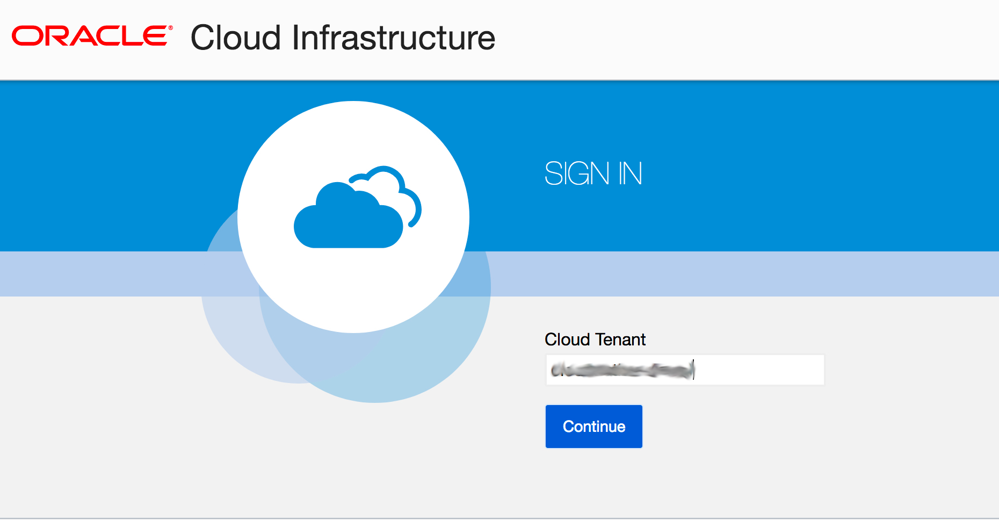
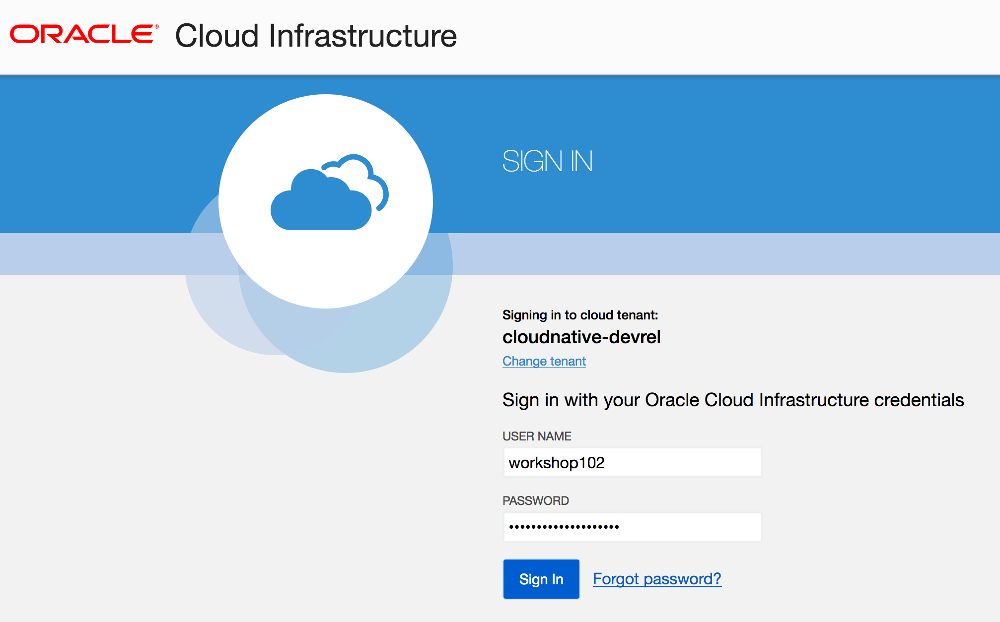
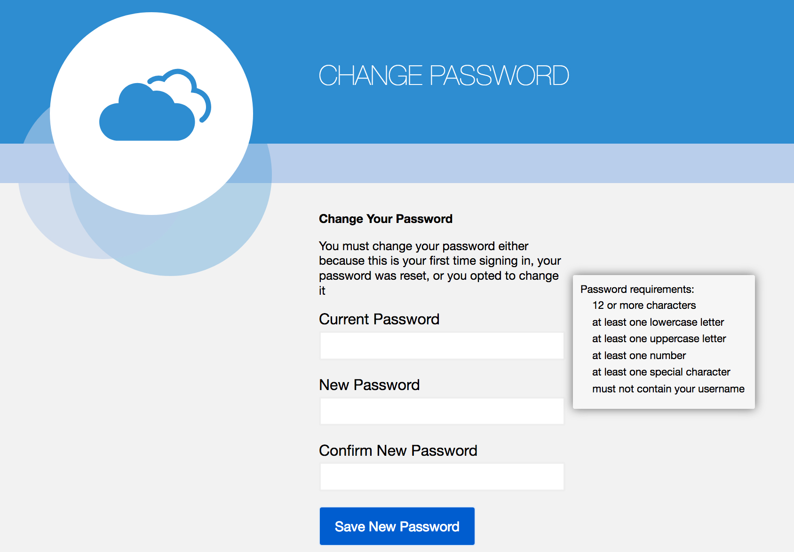
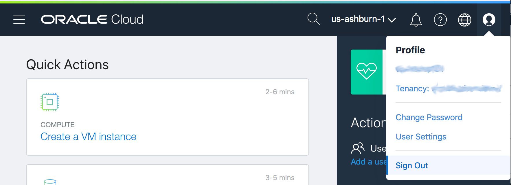
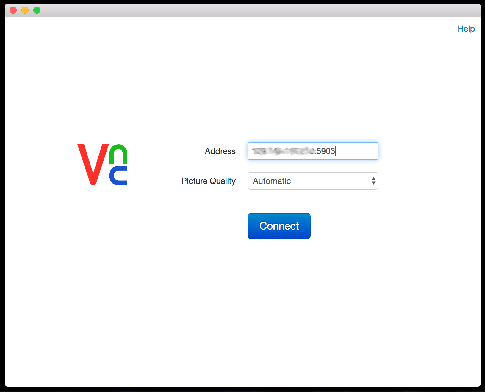

# Environment Setup

For convenience, each lab participant will be provided with an Oracle Cloud
Infrastructure virtual machine configured with all the tools you'll need for
this workshop.

Your workshop instructor will provide you with the following:

1. Participant Number--your unique id that will be incorporated into your user
   id and your virtual machine name.  We'll also use it in the labs.
2. User Id/Password--to enable you to log into the OCI Console and to deploy
   functions
3. Tenancy Name--that you will use to log into the OCI account.
4. IP Address--of your hosted development environment machine
5. VNC Password--to allow you to log into your hosted development machine


> As you make your way through this lab, look out for this icon.
 Whenever you see it, it's time for you to
perform an action.

## Pre-requisites

Before we get started you'll need to log into the OCI account you've been
provided to change your password from the temporary initial password.  Although
we're going to be working in the Phoenix region, you'll need to login into
Ashburn to reset your password.

 Log into the OCI console in Ashburn
specifying the *tenancy* your lab instructor shared with you.

https://console.us-ashburn-1.oraclecloud.com



 Provide your username along with the initial password you were provided.



 Provide a new password satisfying the
requirements and record it for use during the workshop.



 Once you've successfully changed
your password and logged in, log out.  Later on we'll be logging into the
Phoenix region console.



## Configuring your Environment

Now that your user account is accessible, let's log into the provided VM where
you'll be ready to start your configuration.

To access your cloud-based development environment you'll need a VNC client
on your laptop.  You can use whatever you have previously installed or you can
use the VNC Viewer for Chrome that is extremely easy to install.

https://chrome.google.com/webstore/detail/vnc%C2%AE-viewer-for-google-ch/iabmpiboiopbgfabjmgeedhcmjenhbla/related

> NOTE: If you're curious about how to setup your own machine to build functions
> and deploy them to Oracle Functions you can follow the instructions in the
> [Quick Start
> Guide](https://www.oracle.com/webfolder/technetwork/tutorials/infographics/oci_faas_gettingstarted_quickview/functions_quickview_top/functions_quickview/index.html#)

 Log into your VM using the provided IP
Address and password.  The VNC port is **5903** so the server address you'll need
to provide will look like **`n.n.n.n:5903`**

Enter the provided VNC password to complete your login.



> TIP: How to use copy/paste inside your VNC session:
> * Copy text from Firefox browser: Ctrl+C
> * Paste text in to terminal: Shift+Ctrl+V
> * Copy text from terminal: Shift+Ctrl+C
> * Other than the terminal, Ctrl+C/V should work
> * When in doubt, check the application's Edit menu for shortcut keys

Open a terminal and type the following command to ensure you are using the
`workshop` context that points to Oracle Functions:


>```sh
>fn ls contexts
>```

Your output should look something like the following:

```shell
CURRENT NAME      PROVIDER  API URL                                         REGISTRY
        default   default
*       workshop  oracle    https://functions.us-phoenix-1.oraclecloud.com  phx.ocir.io/cloudnative-devrel/workshop-NNN
```

Now to make sure you can be authenticated correctly and communicate with
Oracle Functions let's run a command to list all of the existing applications.
It doesn't matter what the results--just that it runs successfully to confirm
connectivity.


>```sh
>fn ls apps
>```

You may see a list of applications something like this:

```shell
NAME        ID
labapp-NNN  ocid1.fnapp.oc1.us-phoenix-1.aaaaaaaaag4h7xotdzz27sp7z23ci6z4jqj4raq43ui6ouae5k2kl7irx34a
```

Or you may see a message saying "No apps found". That's fine too.

## Clone the Workshop Repo

Before we actually get started let's clone the git repo for this workshop so
that you have all of the necessary materials.  Open a terminal and in your
home directory (i.e., /home/demo) type:


>```sh
>git clone https://github.com/shaunsmith/functionslab.git
>```

In the `functionslab` folder you'll find the sources for this workshop along
with materials for some of the labs you'll be doing.

## All Set!

Now that you're logged into your development machine and are able to communicate
with Oracle Functions it's time to get started!

NEXT: [*Function Labs*](1-Labs.md), UP: [*INDEX*](README.md)
