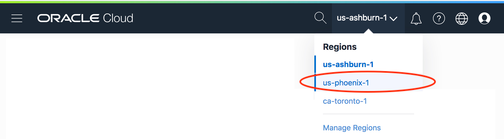
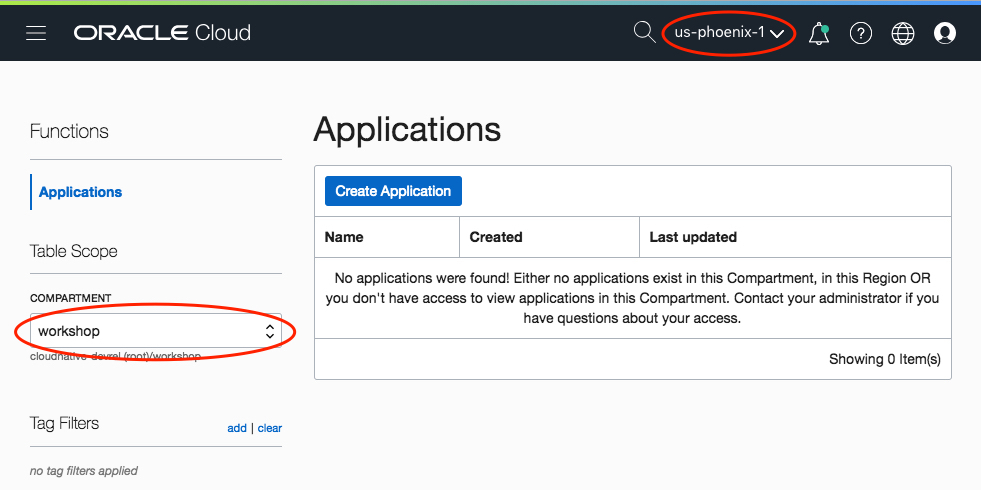
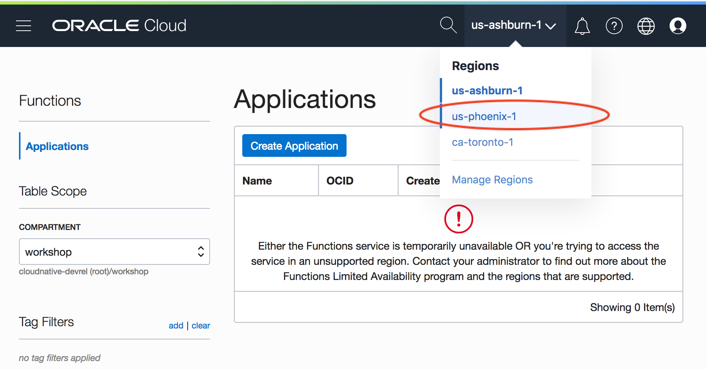
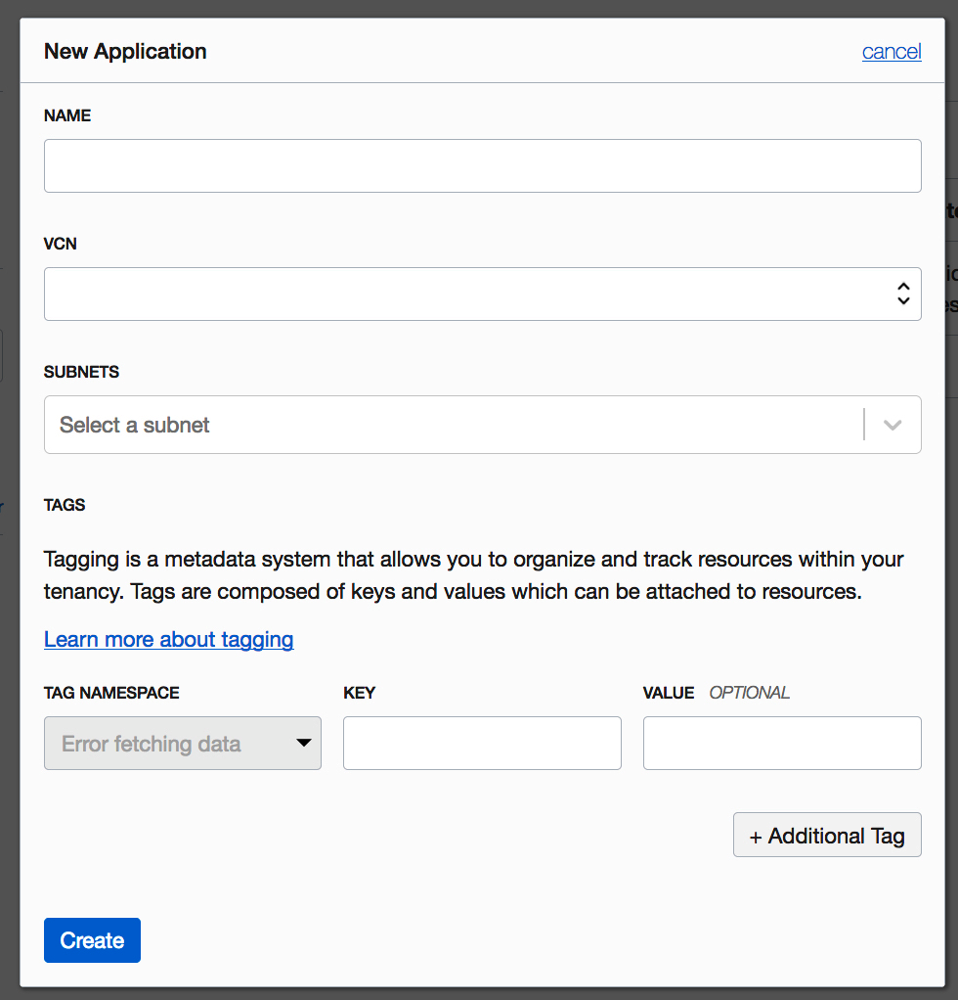
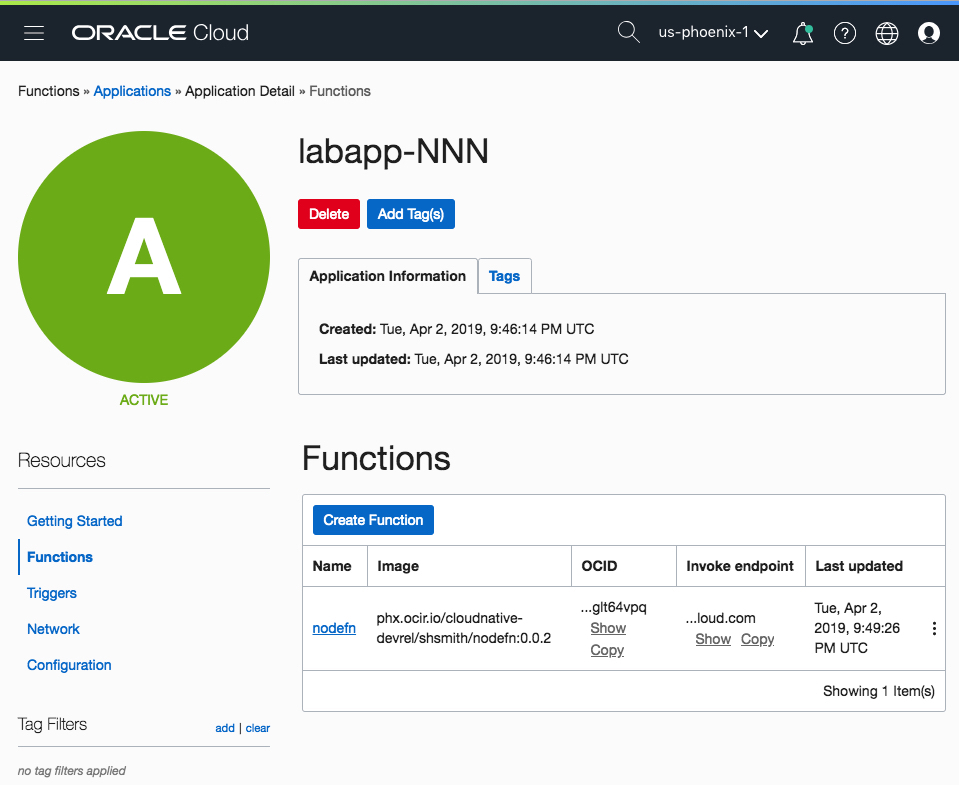

# Your First Function with Node.js

In this introductory lab we'll walk through developing a function using the
JavaScript programming language and Node.js (without installing any Node.js
tools!) and deploying that function Oracle Functions.  We'll also learn about
the core Fn concepts like applications and triggers.

> As you make your way through this lab, look out for this icon.
 Whenever you see it, it's time for you to
perform an action.

Let's start with a very simple "hello world" function written in [Node.js
JavaScript](https://nodejs.org/). Don't worry, you don't need to know Node!  In
fact you don't even need to have Node installed on your development machine as
Fn provides the necessary Node tools as a Docker container.  Let's walk through
your first function to become familiar with the process and how Fn supports
development.


### Create your Function
In the terminal type the following.


>```
> fn init --runtime node nodefn
>```

The output will be

```yaml
Creating function at: /nodefn
Function boilerplate generated.
func.yaml created.
```

The `fn init` command creates a simple function with a bit of boilerplate to get
you started. The `--runtime` option is used to indicate that the function we're
going to develop will be written in Node. A number of other runtimes are also
supported.  Fn creates the simple function along with several supporting files
in the `nodefn` directory.

### Review your Function File

With your function created change into the `/nodefn` directory.


>```
> cd nodefn
>```

Now get a list of the directory contents.


>```
> ls
>```

```sh
func.js func.yaml package.json
```

The `func.js` file which contains your actual Node function is generated along
with several supporting files. To view your Node function type:


>```sh
> cat func.js
>```

```js
const fdk=require('@fnproject/fdk');

fdk.handle(function(input){
  let name = 'World';
  if (input.name) {
    name = input.name;
  }
  return {'message': 'Hello ' + name}
})
```

This function looks for JSON input in the form of `{"name": "Bob"}`. If this
JSON example is passed to the function, the function returns `{"message":"Hello
Bob"}`. If no JSON data is found, the function returns `{"message":"Hello
World"}`.

### Understanding func.yaml

The `fn init` command generated a `func.yaml` function
configuration file. Let's look at the contents:


>```sh
> cat func.yaml
>```

```yaml
schema_version: 20180708
name: nodefn
version: 0.0.1
runtime: node
entrypoint: node func.js
```

The generated `func.yaml` file contains metadata about your function and
declares a number of properties including:

* schema_version--identifies the version of the schema for this function file.
  Essentially, it determines which fields are present in `func.yaml`.
* name--the name of the function. Matches the directory name.
* version--automatically starting at 0.0.1.
* runtime--the name of the runtime/language which was set based on the value set
  in `--runtime`.
* entrypoint--the name of the executable to invoke when your function is called,
  in this case `node func.js`.

There are other user-specifiable properties but these will suffice for this
example.  Note that if not specified, the name of your function will be taken
from the containing folder name. 

### Other Function Files

The `fn init` command generated one other file.

* `package.json` --  specifies all the Node.js dependencies for your Node
  function.

## Your Deployment Target

With the `nodefn` directory containing `func.js` and `func.yaml` you've got
everything you need to deploy the function to Oracle Functions.

Make sure your context is set to point to Oracle Functions. Use the `fn list
contexts` command to check.


>```sh
> fn list contexts
>```

The `API URL` and `REGISTRY` values of the row with the `*` should be pointing
to Oracle Functions and OCIR, respectively:

```shell
CURRENT    NAME        PROVIDER    API URL                                           REGISTRY
           default     default                                                       shaunsmith
*          workshop    oracle      https://functions.us-phoenix-1.oraclecloud.com    phx.ocir.io/mytenancy/myuser
```

If your context *is not* configured correctly, please return to the
[*Environment Setup*](0-Setup.md) instructions before proceeding.

## Deploying your First Function

Deploying your function is how you publish the function and make it accessible
to other users and systems. To see the details of what is happening during a
function deploy,  use the `-v / --verbose` switch.  The first time you build a
function of a particular language it takes longer as the `fn` CLI must download
the necessary Docker images. The `--verbose` option allows you to see this
process.

### Creating an Application

Before you can deploy a function you'll need to create an application.  You can
do this using the `fn` CLI or in the Oracle Functions web console.  We'll use the
console as it's somewhat simpler to click on options than to copy/paste network
IDs for use on the command line.

Open your browser to the Oracle Functions console and
login:

 https://console.us-ashburn-1.oraclecloud.com/functions

 Once you've logged in, select the Phoenix (us-phoenix-1) region:



 Navigate down the compartment hierarchy on the left hand dropdown to the compartment your instructor will provide.



If you haven't selected the `us-phoenix-1` region you'll see the following error.  To
correct simply choose the Phoenix region from the drop down menu.



 click "Create Application" and complete the
form with following values where NNN is your lab participant number.  

**IMPORTANT NOTE**: Lab participants are all working in the same OCI tenancy and
compartment so to avoid confusion you need to name your applications with your
participant number. Wherever you see `NNN` in the lab instructions please
substitute in your number.

>```sh
> name: `labapp-NNN`
> vcn: `workshop-vcn`
> subnet: `Public Subnet nFuS:PHX-AD-1`
>```



Functions deployed as part of this application will be attached to the
specifiied vcn and subnet.

 click "Create" to finish.

### Building and Deploying your Function

The `fn` CLI makes it easy to build and deploy functions.  Building a function
is the process of compiling (if necessary) and packaging your code into a Docker
container.  The deployment step will push the container to OCIR and define the
function in Oracle Functions.  You can do all of this in one command.


>```sh
> fn --v deploy --app labapp-NNN
>```

When we deploy a single function we have to specify the application it belongs
to.

You should see output similar to:

```shell
Deploying nodefn to app: labapp-NNN
Bumped to version 0.0.2
Building image phx.ocir.io/mytenancy/myuser/nodefn:0.0.2
FN_REGISTRY:  phx.ocir.io/mytenancy/myuser
Current Context:  workshop
Sending build context to Docker daemon   5.12kB
Step 1/9 : FROM fnproject/node:dev as build-stage
 ---> 016382f39a51
Step 2/9 : WORKDIR /function
 ---> Using cache
 ---> 17d33f5e5433
Step 3/9 : ADD package.json /function/
 ---> Using cache
 ---> 26821de105b3
Step 4/9 : RUN npm install
 ---> Using cache
 ---> 42c39f1f14bb
Step 5/9 : FROM fnproject/node
 ---> 016382f39a51
Step 6/9 : WORKDIR /function
 ---> Using cache
 ---> 17d33f5e5433
Step 7/9 : ADD . /function/
 ---> 0973c9239c46
Step 8/9 : COPY --from=build-stage /function/node_modules/ /function/node_modules/
 ---> 1785a3d39bec
Step 9/9 : ENTRYPOINT ["node", "func.js"]
 ---> Running in 78424021a8ee
Removing intermediate container 78424021a8ee
 ---> 5c0b79de04e8
Successfully built 5c0b79de04e8
Successfully tagged phx.ocir.io/mytenancy/myuser/nodefn:0.0.2

Parts:  [phx.ocir.io mytenancy myuser nodefn:0.0.2]
Pushing phx.ocir.io/mytenancy/myuser/nodefn:0.0.2 to docker registry...The push refers to repository [phx.ocir.io/mytenancy/myuser/nodefn]
ffc0648dc97f: Pushed
d85ee6e79290: Pushed
0677ac33d692: Pushed
0b3e54ee2e85: Pushed
ad77849d4540: Pushed
5bef08742407: Pushed
0.0.2: digest: sha256:6a15a46ca32ec1bdfe7f49ba5e3ac705adbe15658e795747adb661e46ba73c7f size: 1571
Updating function nodefn using image phx.ocir.io/mytenancy/myuser/nodefn:0.0.2...
Successfully created function: nodefn with phx.ocir.io/mytenancy/myuser/nodefn:0.0.2
```

Since we turned on verbose mode, the steps to build the Docker container image
are displayed. Normally you deploy an application without the `-v/--verbose`
option. If you rerun the command a new image and version is created, pushed to
OCIR, and deployed.

### Functions in the Oracle Functions Console

Click on `labapp-NNN` in the Functions Applications List and you'll see the
`nodefn` function appears in the functions list.



### Invoking your Function with the CLI

There are a few ways you can invoke your function.  The easiest is with the `fn`
CLI.  We'll see other ways in subsequent labs. Type the following:


>```sh
> fn invoke labapp-NNN nodefn
>```

which results in:

```js
{"message":"Hello World"}
```

The first time you call a function in a new application you may encounter what
is commonly called a "cold start," which results in the function call taking
longer than usual. When you invoked "labapp-NNN nodefn," Oracle Functions looked
up the "labapp-NNN" application and then looked for the Docker container image
bound to the "nodefn" function and executed the code. The necessary compute
infrastructure was also allocated.  If you invoke the function a second time
you'll notice it's much faster.

You can also pass data to the invoke command, for example:


>```sh
> echo -n '{"name":"Bob"}' | fn invoke labapp-NNN nodefn
>```

```js
{"message":"Hello Bob"}
```

The JSON data was parsed and since `name` was set to "Bob", that value is passed
in the function response.

### Understand fn deploy

If you have used Docker before the output of `fn --verbose deploy` should look
familiar--it looks like the output you see when running `docker build` with a
Dockerfile.  Of course this is exactly what's happening!  When you deploy a
function like this the `fn` CLI is dynamically generating a Dockerfile for your
function and building a container image.

> __NOTE__: two images are actually being used.  The first contains the language
> compiler and all the necessary build tools. The second image packages all
> dependencies and any necessary language runtime components. Using this
> strategy, the final function image size can be kept as small and secure as
> possible. Smaller Docker images are naturally faster to push and pull from a
> registry which improves overall performance.  For more details on this
> technique see [Multi-Stage Docker Builds for Creating Tiny Go
> Images](https://medium.com/travis-on-docker/multi-stage-docker-builds-for-creating-tiny-go-images-e0e1867efe5a).

As the `fn` CLI is built on Docker you can use the `docker` command to see the local
container image you just generated. You may have a number of Docker images so
use the following command to see only versions of nodefn:


>```sh
> docker images | grep nodefn
>```

You should see something like:

```sh
phx.ocir.io/mytenancy/myuser/nodefn   0.0.2    5c0b79de04e8   15 minutes ago  66.3MB
phx.ocir.io/mytenancy/myuser/nodefn   0.0.1    4936dbed0df6   40 minutes ago  66.3MB
```

### Explore your Application

The fn CLI provides a couple of commands to let us see what we've deployed.
`fn list apps` returns a list of all of the defined applications.


>```sh
> fn list apps
>```

Which, in our case, returns the name of the application we created when we
deployed our `nodefn` function:

```shell
NAME         ID
labapp-NNN   ocid1.fnapp.oc1.us-phoenix-1.aaaaaaaaafe33ayhrq5dkeplxk6wd5fpyhc7chufehxjhv7kgbnrbevbovma
```

We can also see the functions that are defined by an application. To list the
functions included in "labapp-NNN" we can type:


>```sh
> fn ls f labapp-NNN
>```

```sh
NAME    IMAGE                                                  ID
nodefn  phx.ocir.io/mytenancy/myuser/nodefn:0.0.2    ocid1.fnfunc.oc1.us-phoenix-1.aaaaaaaaacm4u6futn2q34fh4hbkirwsxdffss42kvd3kl6xxakkful5yehq
```

## Wrap Up

Congratulations!  In this lab you've accomplished a lot.  You've created
your first function, deployed it to Oracle Functions and invoked it!

NEXT: [*Java Functions*](4-Java-Functions.md), UP: [*Labs*](1-Labs.md), HOME:
[*INDEX*](README.md)
