# Invoke Oracle Functions Using OCI Events service

This lab walks you through how to invoke a function deployed to Oracle Functions
automatically using another serverless service - Oracle Cloud Infrastructure
(OCI) Events service. We will trigger a function when an object is uploaded to
an OCI Object Storage bucket. We will use OCI Events service to automatically
invoke our function which will retrieve metadata from the image. All this
without having to provision, manage and scale servers!

## OCI Events service

OCI Events service is a fully managed service that lets you track changes in
your OCI resources and respond to them using Oracle Functions, Notifications,
and Streaming services. OCI Events service is compliant with Cloud Native
Computing Foundation (CNCF) CloudEvents for seamless interoperability with the
cloud native ecosystem.

You can build event-driven, cloud native, serverless applications using Oracle Functions
and OCI Events. 

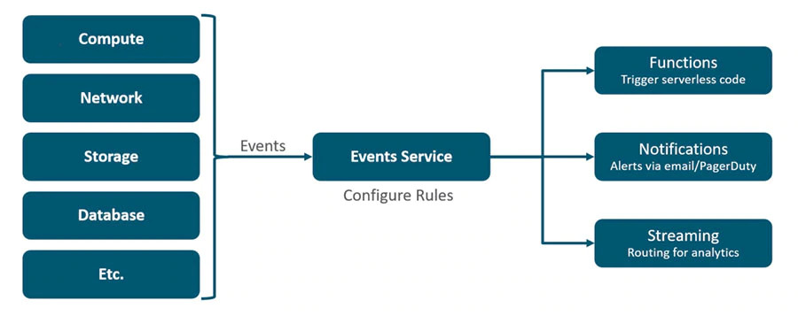

For more information about the OCI Events service please see the [service
documentation](https://docs.cloud.oracle.com/iaas/Content/Events/Concepts/eventsoverview.htm).
Before we dive in to our function, let us start with a simple test using OCI
Notifications service. Let us create a topic with an email subscription and
configure an Event rule to route the event to your email address.

## Create an OCI Notifications Service (ONS) Topic and Email Subscription


Click on Application Integration -> Notifications in the left navigation menu:

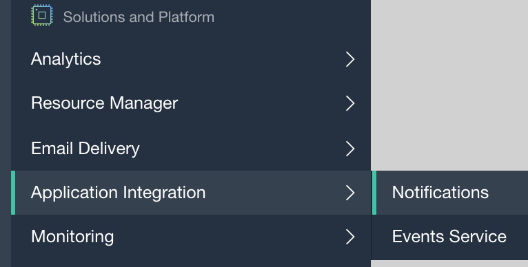


Click on "Create Topic":

**IMPORTANT NOTE**: All lab participants are working in the same OCI tenancy and
compartment. So, to avoid confusion you need to name your OCI resources with your
participant number. Wherever you see `NNN` in the lab instructions, please
substitute it with your participant number.

>```
> Name: topic-NNN
>```

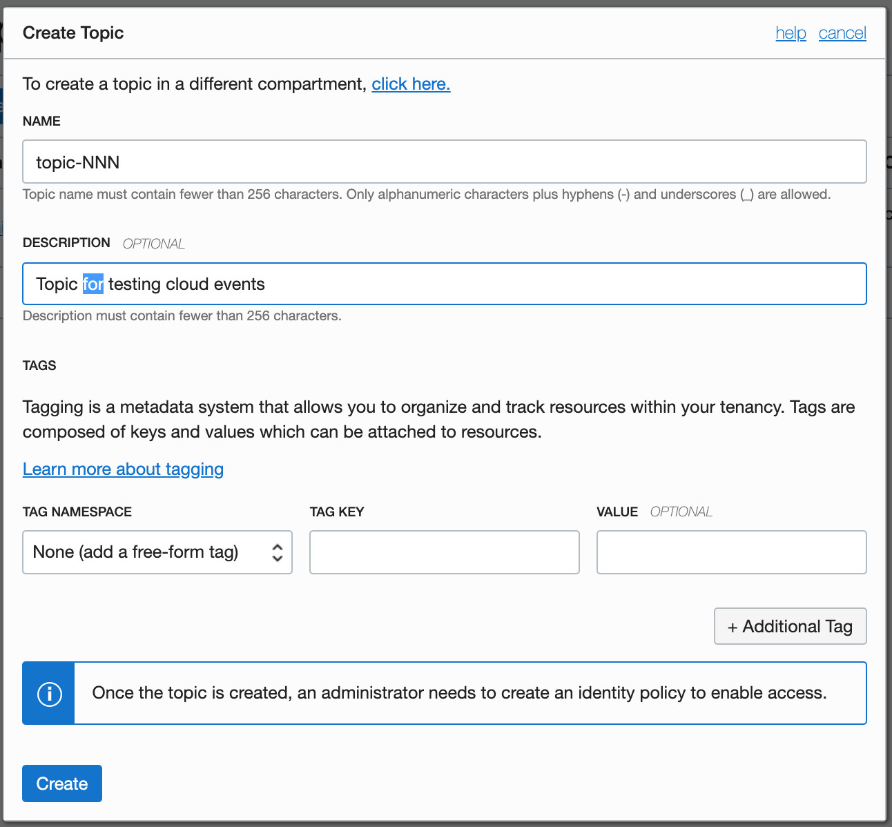


Navigate into the Topic Details page, Click on "Create Subscription", select
"Email", and enter your email address:

>```
> Protocol: Email
> Email address: <enter your email address>
>```

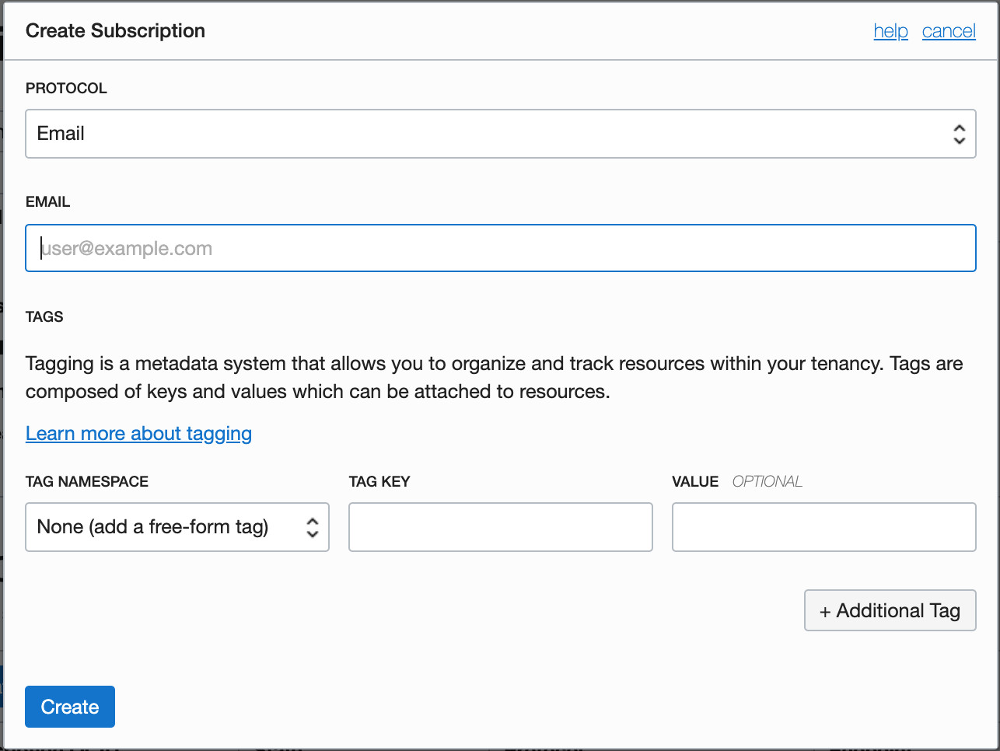


Next, you need to activate your email subscription.


Check your email. You will receive an email with the subject "Oracle Cloud
Infrastructure Notifications Service Subscription Confirmation". Confirm the
subscription by clicking on the link provided in the email. You will see a
"Subscription confirmed" message in the browser. Now this subscription will be
in the "Active" state in the OCI console.

Next, let us test the email subscription with a test message.


You can test the subscription by clicking the "Publish Message" button on the
topic screen in the OCI console. Confirm that you receive the test message in
your inbox.


## Create an OCI Event rule

Now, let us create an Event rule to route Object Storage object created events
to the above ONS topic/email subscription.


Click on Application Integration -> Events Service in the left navigation menu:

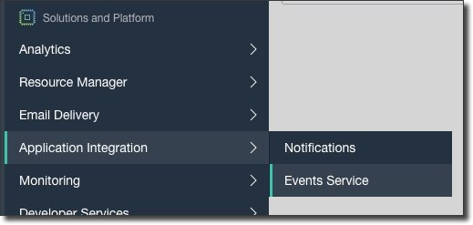


You can listen to specific events using filter criteria. In this case, we are
only interested in uploads to our specific Object Storage bucket. So, let us use
the "Object Storage - Create Object" event with "bucketName" as the filter
criteria. Refer to the service documentation for more information on the event
types and filters.


Select your-lab-compartment. Click on 'Create Rule' and populate the form with
the following values:

>```
> Name: cloud-events-NNN
> 
> Select "Event Type"
> Service Name: Object Storage
> Event Type: Object Storage - Create Object
> 
> Add Condition and select "Attribute"
> Attribute Name: bucketName
> Attribute Value: object-upload-NNN
>```

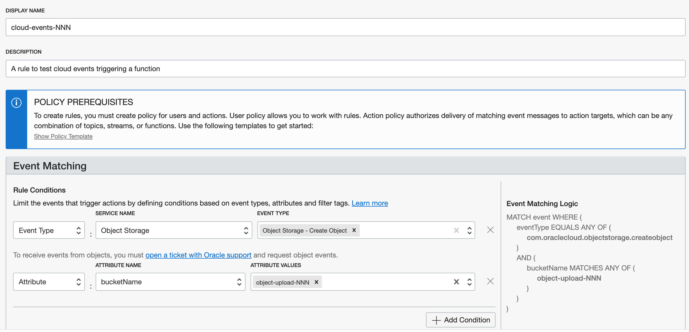


Under Actions, select the ONS topic created above.

>```
> Action Type: Notifications
> Compartment: select-your-lab-compartment
> Topic: topic-NNN
>```

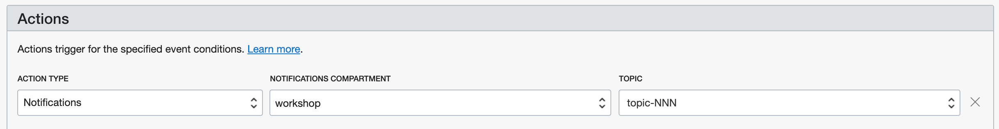


Click Create Rule

## Create a public Object Storage bucket and upload an image

Next, we will create a public Object Storage bucket and upload an image to
trigger an email notification.


Navigate to the Object Storage console.

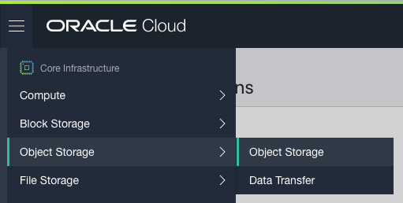


Select your-lab-compartment. Create an Object Storage bucket:

>```
> Bucket name: object-upload-NNN
>```

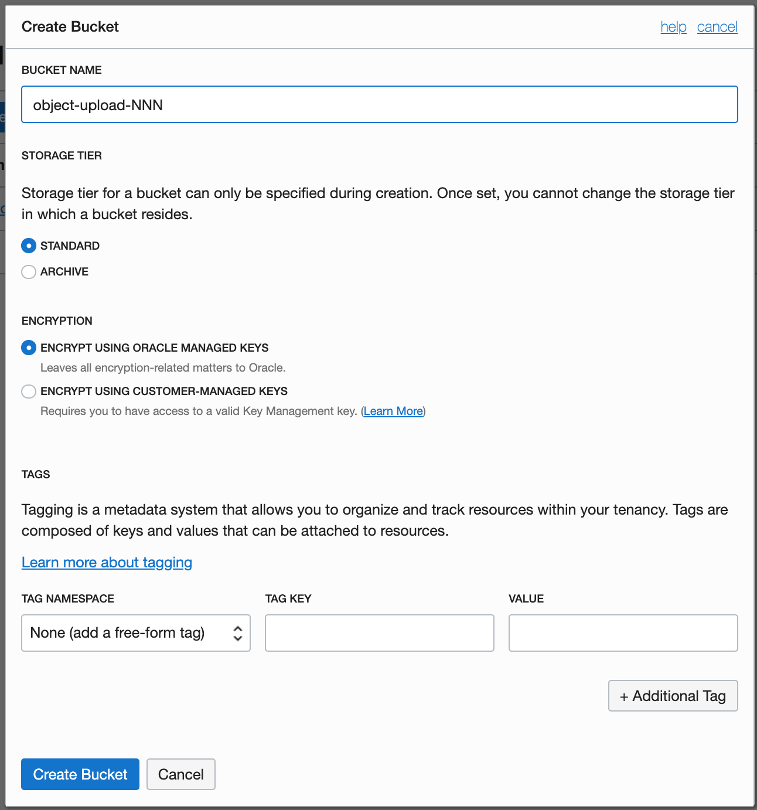

Once the bucket is created, we change its visibility to make it public.


Click on "Edit Visibility" in the item menu and select "Public":

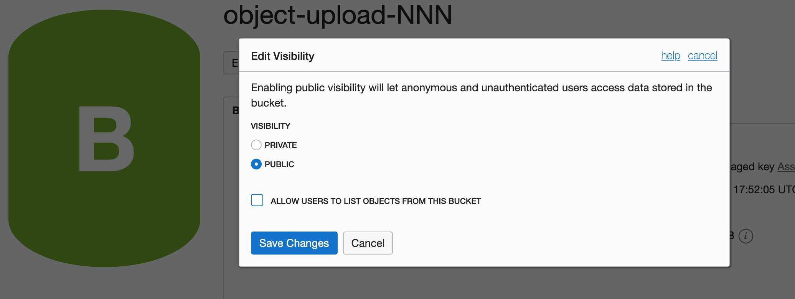

Now that our bucket is created and made public, we can upload an image file.


Upload the image `sachin-in.jpg` from this location
[/oci-event-triggers/sachin-in.jpg](/oci-event-triggers/sachin-in.jpg)
to your bucket.

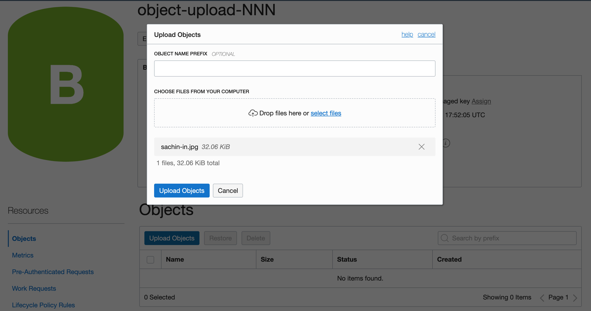


This will generate an Object Created event, which in turn will trigger an email
notification. In about 60 seconds, you should see an email in your inbox with
the cloud event JSON (similar to the JSON shown below):

```json
{
    "eventType" : "com.oraclecloud.objectstorage.createobject",
    "cloudEventsVersion" : "0.1",
    "eventTypeVersion" : "2.0",
    "source" : "ObjectStorage",
    "eventTime" : "2019-11-17T21:08:03.401Z",
    "contentType" : "application/json",
    "data" : {
      "compartmentId" : "ocid1.compartment.oc1..aaaaaaaanqa2dxz6gtcygu6yeh6wigslwxvwllbhd2sxasdfasdfasdfbq",
      "compartmentName" : "compartment-name",
      "resourceName" : "sachin-in.jpg",
      "resourceId" : "/n/namespace/b/object-upload-NNN/o/sachin-in.jpg",
      "availabilityDomain" : "PHX-AD-1",
      "additionalDetails" : {
        "bucketName" : "object-upload-NNN",
        "archivalState" : "Available",
        "namespace" : "namespace",
        "bucketId" : "ocid1.bucket.oc1.phx.aaaaaaaaaboojfoukd7gdvkfundi33pl6cxcebev5b237t6asdfasdfasdfuq",
        "eTag" : "b744b0de-db9f-4804-8624-90a2883821f0"
      }
    },
    "eventID" : "c5c593eb-8dad-f249-97fe-9a1a9cad0e25",
    "extensions" : {
      "compartmentId" : "ocid1.compartment.oc1..aaaaaaaanqa2dxz6gtcygu6yeh6wigslwxvwllbhd2sxasdfasdfasdfbq"
    }
}
```

Congratulations! We have confirmed the event gets generated and triggers the
event rule to send an email notification. Now let us proceed to trigger a
function in response to the event.

## Create a function

Now, let us create a function to process the cloud event. 


Create a boilerplate Java function using the fn CLI:

>```
> fn init --runtime java cloud-events-demo-fn
>```

The output will be:

```shell
Creating function at: ./cloud-events-demo-fn
Function boilerplate generated.
func.yaml created.
```


>```
> cd cloud-events-demo-fn
>```

Now we will add two dependencies to the pom.xml file. One for the
cloudevents-api, and another for metadata-extractor so we can extract the image
metadata later on. 

 
Edit the pom.xml file and add the following dependencies:

```xml
<dependency>
    <groupId>io.cloudevents</groupId>
    <artifactId>cloudevents-api</artifactId>
    <version>0.2.1</version>
</dependency>
<dependency>
    <groupId>com.drewnoakes</groupId>
    <artifactId>metadata-extractor</artifactId>
    <version>2.12.0</version>
</dependency>
```

Next, lets implement a function to handle the incoming cloud event. Since OCI
Cloud Events conform to the CNCF Cloud Events specification, we can safely type
our incoming parameter as a CloudEvent and the FDK will handle properly
serializing the parameter when the function is triggered. Once we have our
CloudEvent data we can construct a URL that points to our image (a public image
in this case) and open that URL as a stream that can be passed to the metadata
extractor.

 
Replace the definition of HelloFunction with the following:

```java
package com.example.fn;

import com.drew.imaging.ImageMetadataReader;
import com.drew.imaging.ImageProcessingException;
import com.drew.metadata.Metadata;
import com.fasterxml.jackson.databind.ObjectMapper;
import io.cloudevents.CloudEvent;

import java.io.IOException;
import java.io.InputStream;
import java.net.URL;
import java.util.Map;

public class HelloFunction {

    public Metadata handleRequest(CloudEvent event) throws IOException, ImageProcessingException {
        ObjectMapper objectMapper = new ObjectMapper();
        Map data = objectMapper.convertValue(event.getData().get(), Map.class);
        Map additionalDetails = objectMapper.convertValue(data.get("additionalDetails"), Map.class);

        String imageUrl = "https://objectstorage.us-phoenix-1.oraclecloud.com/n/" +
                additionalDetails.get("namespace") +
                "/b/" +
                additionalDetails.get("bucketName") +
                "/o/" +
                data.get("resourceName");
        System.out.println("imageUrl: " + imageUrl);

        InputStream imageStream = new URL(imageUrl).openStream();
        Metadata metadata = ImageMetadataReader.readMetadata(imageStream);
        System.out.println(objectMapper.writeValueAsString(metadata));

        return metadata;
    }

}
```

## Test class for your function

Before we run an end-to-end test, let us write a simple test for our
function.

**Note: This test assumes the image `sachin-in.jpg` has been uploaded to 
your `public` bucket `object-upload-NNN` in the above step**


Replace the definition of HelloFunctionTest with the following:

```java
package com.example.fn;

import com.fnproject.fn.testing.*;
import org.junit.*;

import static org.junit.Assert.*;

public class HelloFunctionTest {

    @Rule
    public final FnTestingRule testing = FnTestingRule.createDefault();

    @Test
    public void shouldReturnGreeting() {
        String event = "<your test image event JSON>";
        testing.givenEvent().withBody(event).enqueue();
        testing.thenRun(HelloFunction.class, "handleRequest");

        FnResult result = testing.getOnlyResult();
        assertTrue(result.isSuccess());
    }

}
```


Generate a string representation of the Object Created cloud event JSON using a
JSON-to-string conversion tool like
https://tools.knowledgewalls.com/jsontostring

**Note: In the string representation, look for `\/` and remove the backslash `\` 
so for example `application\/json` looks like `application/json` and 
`"\/n\/namespace\/b\/object-upload-NNN\/o\/sachin-in.jpg\"` looks like 
`"/n/namespace/b/object-upload-NNN/o/sachin-in.jpg\"` **
 

```json
"{\"eventType\":\"com.oraclecloud.objectstorage.createobject\",\"cloudEventsVersion\":\"0.1\",\"eventTypeVersion\":\"2.0\",\"source\":\"ObjectStorage\",\"eventTime\":\"2019-11-17T21:08:03.401Z\",\"contentType\":\"application/json\",\"data\":{\"compartmentId\":\"ocid1.compartment.oc1..aaaaaaaanqa2dxz6gtcygu6yeh6wigslwxvwllbhd2sxasdfasdfasdfbq\",\"compartmentName\":\"compartment-name\",\"resourceName\":\"sachin-in.jpg\",\"resourceId\":\"/n/namespace/b/object-upload-NNN/o/sachin-in.jpg\",\"availabilityDomain\":\"PHX-AD-1\",\"additionalDetails\":{\"bucketName\":\"object-upload-NNN\",\"archivalState\":\"Available\",\"namespace\":\"namespace\",\"bucketId\":\"ocid1.bucket.oc1.phx.aaaaaaaaaboojfoukd7gdvkfundi33pl6cxcebev5b237t6asdfasdfasdfuq\",\"eTag\":\"b744b0de-db9f-4804-8624-90a2883821f0\"}},\"eventID\":\"c5c593eb-8dad-f249-97fe-9a1a9cad0e25\",\"extensions\":{\"compartmentId\":\"ocid1.compartment.oc1..aaaaaaaanqa2dxz6gtcygu6yeh6wigslwxvwllbhd2sxasdfasdfasdfbq\"}}"
```


In HelloFunctionTest.java, replace the test event "your test image event 
JSON" with the generated string representation of the cloud event JSON:

```java
String event = "{\"eventType\":\"com.oraclecloud.objectstorage.createobject\",\"cloudEventsVersion\":\"0.1\",\"eventTypeVersion\":\"2.0\",\"source\":\"ObjectStorage\",\"eventTime\":\"2019-11-17T21:08:03.401Z\",\"contentType\":\"application/json\",\"data\":{\"compartmentId\":\"ocid1.compartment.oc1..aaaaaaaanqa2dxz6gtcygu6yeh6wigslwxvwllbhd2sxasdfasdfasdfbq\",\"compartmentName\":\"compartment-name\",\"resourceName\":\"sachin-in.jpg\",\"resourceId\":\"/n/namespace/b/object-upload-NNN/o/sachin-in.jpg\",\"availabilityDomain\":\"PHX-AD-1\",\"additionalDetails\":{\"bucketName\":\"object-upload-NNN\",\"archivalState\":\"Available\",\"namespace\":\"namespace\",\"bucketId\":\"ocid1.bucket.oc1.phx.aaaaaaaaaboojfoukd7gdvkfundi33pl6cxcebev5b237t6asdfasdfasdfuq\",\"eTag\":\"b744b0de-db9f-4804-8624-90a2883821f0\"}},\"eventID\":\"c5c593eb-8dad-f249-97fe-9a1a9cad0e25\",\"extensions\":{\"compartmentId\":\"ocid1.compartment.oc1..aaaaaaaanqa2dxz6gtcygu6yeh6wigslwxvwllbhd2sxasdfasdfasdfbq\"}}";
```

Now our test class is ready for use. Let's proceed to build/deploy your
function.

## Build, test and deploy your function

At this point we have everything we need to build, test and deploy our
function.


Run the fn deploy command:

>```
> fn -v deploy --app labapp-NNN
>```

You should see the following output:

```shell
Deploying cloud-events-demo-fn to app: labapp-NNN
Bumped to version 0.0.8
Building image iad.ocir.io/tenant-namespace/workshop-NNN/cloud-events-demo-fn:0.0.8 
FN_REGISTRY:  iad.ocir.io/tenant-namespace/workshop-NNN
Current Context:  workshop
Sending build context to Docker daemon   16.9kB
Step 1/11 : FROM fnproject/fn-java-fdk-build:jdk11-1.0.99 as build-stage
 ---> 8f671937cc94
Step 2/11 : WORKDIR /function
 ---> Using cache
 ---> ac43afba97f2
Step 3/11 : ENV MAVEN_OPTS -Dhttp.proxyHost= -Dhttp.proxyPort= -Dhttps.proxyHost= -Dhttps.proxyPort= -Dhttp.nonProxyHosts= -Dmaven.repo.local=/usr/share/maven/ref/repository
 ---> Using cache
 ---> 11eaa8831c5e
Step 4/11 : ADD pom.xml /function/pom.xml
 ---> Using cache
 ---> 655878f46baf
Step 5/11 : RUN ["mvn", "package", "dependency:copy-dependencies", "-DincludeScope=runtime", "-DskipTests=true", "-Dmdep.prependGroupId=true", "-DoutputDirectory=target", "--fail-never"]
 ---> Using cache
 ---> a606117e028c
Step 6/11 : ADD src /function/src
 ---> 56a9bcfd99fe
Step 7/11 : RUN ["mvn", "package"]
 ---> Running in 4d481e7bfa33
[INFO] Scanning for projects...
[INFO] 
[INFO] ------------------------< com.example.fn:hello >------------------------
[INFO] Building hello 1.0.0
[INFO] --------------------------------[ jar ]---------------------------------
[INFO] 
[INFO] --- maven-resources-plugin:2.6:resources (default-resources) @ hello ---
[INFO] Using 'UTF-8' encoding to copy filtered resources.
[INFO] skip non existing resourceDirectory /function/src/main/resources
[INFO] 
[INFO] --- maven-compiler-plugin:3.3:compile (default-compile) @ hello ---
[INFO] Changes detected - recompiling the module!
[INFO] Compiling 1 source file to /function/target/classes
[INFO] 
[INFO] --- maven-resources-plugin:2.6:testResources (default-testResources) @ hello ---
[INFO] Using 'UTF-8' encoding to copy filtered resources.
[INFO] skip non existing resourceDirectory /function/src/test/resources
[INFO] 
[INFO] --- maven-compiler-plugin:3.3:testCompile (default-testCompile) @ hello ---
[INFO] Changes detected - recompiling the module!
[INFO] Compiling 1 source file to /function/target/test-classes
[INFO] 
[INFO] --- maven-surefire-plugin:2.22.1:test (default-test) @ hello ---
[INFO] 
[INFO] -------------------------------------------------------
[INFO]  T E S T S
[INFO] -------------------------------------------------------
[INFO] Running com.example.fn.HelloFunctionTest
imageUrl: https://objectstorage.us-phoenix-1.oraclecloud.com/n/tenant-namespace/b/object-upload-NNN/o/sachin-in.jpg
{"directoryCount":6,"directories":[{"imageWidth":500,"imageHeight":324,"numberOfComponents":3,"name":"JPEG","tagCount":8,"errorCount":0,"tags":[{"description":"Baseline","tagName":"Compression Type","tagType":-3,"tagTypeHex":"0xfffffffd","directoryName":"JPEG"},{"description":"8 bits","tagName":"Data Precision","tagType":0,"tagTypeHex":"0x0000","directoryName":"JPEG"},{"description":"324 pixels","tagName":"Image Height","tagType":1,"tagTypeHex":"0x0001","directoryName":"JPEG"},{"description":"500 pixels","tagName":"Image Width","tagType":3,"tagTypeHex":"0x0003","directoryName":"JPEG"},{"description":"3","tagName":"Number of Components","tagType":5,"tagTypeHex":"0x0005","directoryName":"JPEG"},{"description":"Y component: Quantization table 0, Sampling factors 1 horiz/1 vert","tagName":"Component 1","tagType":6,"tagTypeHex":"0x0006","directoryName":"JPEG"},{"description":"Cb component: Quantization table 1, Sampling factors 1 horiz/1 vert","tagName":"Component 2","tagType":7,"tagTypeHex":"0x0007","directoryName":"JPEG"},{"description":"Cr component: Quantization table 1, Sampling factors 1 horiz/1 vert","tagName":"Component 3","tagType":8,"tagTypeHex":"0x0008","directoryName":"JPEG"}],"errors":[],"empty":false,"parent":null},{"version":258,"resUnits":0,"resY":100,"resX":100,"imageWidth":100,"imageHeight":100,"name":"JFIF","tagCount":6,"errorCount":0,"tags":[{"description":"1.2","tagName":"Version","tagType":5,"tagTypeHex":"0x0005","directoryName":"JFIF"},{"description":"none","tagName":"Resolution Units","tagType":7,"tagTypeHex":"0x0007","directoryName":"JFIF"},{"description":"100 dots","tagName":"X Resolution","tagType":8,"tagTypeHex":"0x0008","directoryName":"JFIF"},{"description":"100 dots","tagName":"Y Resolution","tagType":10,"tagTypeHex":"0x000a","directoryName":"JFIF"},{"description":"0","tagName":"Thumbnail Width Pixels","tagType":12,"tagTypeHex":"0x000c","directoryName":"JFIF"},{"description":"0","tagName":"Thumbnail Height Pixels","tagType":13,"tagTypeHex":"0x000d","directoryName":"JFIF"}],"errors":[],"empty":false,"parent":null},{"name":"Ducky","tagCount":2,"errorCount":0,"tags":[{"description":"64","tagName":"Quality","tagType":1,"tagTypeHex":"0x0001","directoryName":"Ducky"},{"description":"Oct 1989:  Portrait of Sachin Tendulkar of India in Lahore, Pakistan. \\ Mandatory Credit: Ben  Radford/Allsport","tagName":"Comment","tagType":2,"tagTypeHex":"0x0002","directoryName":"Ducky"}],"errors":[],"empty":false,"parent":null},{"name":"Adobe JPEG","tagCount":4,"errorCount":0,"tags":[{"description":"25600","tagName":"DCT Encode Version","tagType":0,"tagTypeHex":"0x0000","directoryName":"Adobe JPEG"},{"description":"192","tagName":"Flags 0","tagType":1,"tagTypeHex":"0x0001","directoryName":"Adobe JPEG"},{"description":"0","tagName":"Flags 1","tagType":2,"tagTypeHex":"0x0002","directoryName":"Adobe JPEG"},{"description":"YCbCr","tagName":"Color Transform","tagType":3,"tagTypeHex":"0x0003","directoryName":"Adobe JPEG"}],"errors":[],"empty":false,"parent":null},{"numberOfTables":4,"typical":false,"optimized":true,"name":"Huffman","tagCount":1,"errorCount":0,"tags":[{"description":"4 Huffman tables","tagName":"Number of Tables","tagType":1,"tagTypeHex":"0x0001","directoryName":"Huffman"}],"errors":[],"empty":false,"parent":null},{"name":"File Type","tagCount":4,"errorCount":0,"tags":[{"description":"JPEG","tagName":"Detected File Type Name","tagType":1,"tagTypeHex":"0x0001","directoryName":"File Type"},{"description":"Joint Photographic Experts Group","tagName":"Detected File Type Long Name","tagType":2,"tagTypeHex":"0x0002","directoryName":"File Type"},{"description":"image/jpeg","tagName":"Detected MIME Type","tagType":3,"tagTypeHex":"0x0003","directoryName":"File Type"},{"description":"jpg","tagName":"Expected File Name Extension","tagType":4,"tagTypeHex":"0x0004","directoryName":"File Type"}],"errors":[],"empty":false,"parent":null}]}
[INFO] Tests run: 1, Failures: 0, Errors: 0, Skipped: 0, Time elapsed: 3.969 s - in com.example.fn.HelloFunctionTest
[INFO] 
[INFO] Results:
[INFO] 
[INFO] Tests run: 1, Failures: 0, Errors: 0, Skipped: 0
[INFO] 
[INFO] 
[INFO] --- maven-jar-plugin:2.4:jar (default-jar) @ hello ---
[INFO] Building jar: /function/target/hello-1.0.0.jar
[INFO] ------------------------------------------------------------------------
[INFO] BUILD SUCCESS
[INFO] ------------------------------------------------------------------------
[INFO] Total time:  9.405 s
[INFO] Finished at: 2019-08-25T14:16:52Z
[INFO] ------------------------------------------------------------------------
Removing intermediate container 4d481e7bfa33
 ---> 820e9a6852dd
Step 8/11 : FROM fnproject/fn-java-fdk:jre11-1.0.99
 ---> 552d503f8aa1
Step 9/11 : WORKDIR /function
 ---> Using cache
 ---> e3c8525f04ad
Step 10/11 : COPY --from=build-stage /function/target/*.jar /function/app/
 ---> e05353e99461
Step 11/11 : CMD ["com.example.fn.HelloFunction::handleRequest"]
 ---> Running in 1921bac644c5
Removing intermediate container 1921bac644c5
 ---> 14dbc09a9918
Successfully built 14dbc09a9918
Successfully tagged iad.ocir.io/tenant-namespace/workshop-NNN/cloud-events-demo-fn:0.0.8

Parts:  [iad.ocir.io tenant-namespace workshop-NNN cloud-events-demo-fn:0.0.8]
Pushing iad.ocir.io/tenant-namespace/workshop-NNN/cloud-events-demo-fn:0.0.8 to docker registry...The push refers to repository [iad.ocir.io/tenant-namespace/workshop-NNN/cloud-events-demo-fn]
d910070a76f0: Pushed 
41b8a6435811: Layer already exists 
9f47f6e68a04: Layer already exists 
815ce0cceeb3: Layer already exists 
580508f3f933: Layer already exists 
be4626a574d8: Layer already exists 
15d57950dad3: Layer already exists 
2bf534399aca: Layer already exists 
1c95c77433e8: Layer already exists 
0.0.8: digest: sha256:ed7f354009fd2a990e3a03eabd6fd0a887c7cb24ef32aee600bfaed4518448f6 size: 2208
Updating function cloud-events-demo-fn using image iad.ocir.io/tenant-namespace/workshop-NNN/cloud-events-demo-fn:0.0.8...
```

Congratulations! You have successfully built,  tested and deployed your function.
Before we run the end-to-end test, let us try and invoke the deployed function 
manually. 


## Manually invoke your function

We can manually invoke our function by passing the above cloud event string.

**Note: This test assumes the image `sachin-in.jpg` has been uploaded to 
your `public` bucket `object-upload-NNN` in the above step**


Run the fn invoke command:

>```
> echo "[event JSON string]" | fn invoke labapp-NNN cloud-events-demo-fn
>```

Here's the same command showing a sample cloud event string:

>```
> echo "{\"cloudEventsVersion\":\"0.1\",\"eventID\":\"aa00367d-8281-476a-b918-0e821f1e2f6d\",\"eventType\":\"com.oraclecloud.objectstorage.createobject\",\"source\":\"objectstorage\",\"eventTypeVersion\":\"1.0\",\"eventTime\":\"2019-08-25T14:01:46Z\",\"schemaURL\":null,\"contentType\":\"application/json\",\"extensions\":{\"compartmentId\":\"ocid1.compartment.oc1..aaa...\"},\"data\":{\"compartmentId\":\"ocid1.compartment.oc1..aaa...\",\"compartmentName\":\"your-compartment-name\",\"resourceName\":\"sachin-in.jpg\",\"resourceId\":\"\",\"availabilityDomain\":null,\"freeFormTags\":{},\"definedTags\":{},\"additionalDetails\":{\"eTag\":\"65efdaae-9464-45e8-b564-4df86f11198a\",\"namespace\":\"tenant-namespace\",\"archivalState\":\"Available\",\"bucketName\":\"object-upload-NNN\",\"bucketId\":\"ocid1.bucket.oc1.iad.aaa...\"}}}" | fn invoke labapp-NNN cloud-events-demo-fn
>```

You should see the following output on the screen:

```shell
{"directories":[{"name":"JPEG","imageWidth":500,"imageHeight":324,"numberOfComponents":3,"empty":false,"parent":null,"tagCount":8,"errorCount":0,"tags":[{"directoryName":"JPEG","description":"Baseline","tagName":"Compression Type","tagType":-3,"tagTypeHex":"0xfffffffd"},{"directoryName":"JPEG","description":"8 bits","tagName":"Data Precision","tagType":0,"tagTypeHex":"0x0000"},{"directoryName":"JPEG","description":"324 pixels","tagName":"Image Height","tagType":1,"tagTypeHex":"0x0001"},{"directoryName":"JPEG","description":"500 pixels","tagName":"Image Width","tagType":3,"tagTypeHex":"0x0003"},{"directoryName":"JPEG","description":"3","tagName":"Number of Components","tagType":5,"tagTypeHex":"0x0005"},{"directoryName":"JPEG","description":"Y component: Quantization table 0, Sampling factors 1 horiz/1 vert","tagName":"Component 1","tagType":6,"tagTypeHex":"0x0006"},{"directoryName":"JPEG","description":"Cb component: Quantization table 1, Sampling factors 1 horiz/1 vert","tagName":"Component 2","tagType":7,"tagTypeHex":"0x0007"},{"directoryName":"JPEG","description":"Cr component: Quantization table 1, Sampling factors 1 horiz/1 vert","tagName":"Component 3","tagType":8,"tagTypeHex":"0x0008"}],"errors":[]},{"name":"JFIF","version":258,"resUnits":0,"resY":100,"resX":100,"imageWidth":100,"imageHeight":100,"empty":false,"parent":null,"tagCount":6,"errorCount":0,"tags":[{"directoryName":"JFIF","description":"1.2","tagName":"Version","tagType":5,"tagTypeHex":"0x0005"},{"directoryName":"JFIF","description":"none","tagName":"Resolution Units","tagType":7,"tagTypeHex":"0x0007"},{"directoryName":"JFIF","description":"100 dots","tagName":"X Resolution","tagType":8,"tagTypeHex":"0x0008"},{"directoryName":"JFIF","description":"100 dots","tagName":"Y Resolution","tagType":10,"tagTypeHex":"0x000a"},{"directoryName":"JFIF","description":"0","tagName":"Thumbnail Width Pixels","tagType":12,"tagTypeHex":"0x000c"},{"directoryName":"JFIF","description":"0","tagName":"Thumbnail Height Pixels","tagType":13,"tagTypeHex":"0x000d"}],"errors":[]},{"name":"Ducky","empty":false,"parent":null,"tagCount":2,"errorCount":0,"tags":[{"directoryName":"Ducky","description":"64","tagName":"Quality","tagType":1,"tagTypeHex":"0x0001"},{"directoryName":"Ducky","description":"Oct 1989:  Portrait of Sachin Tendulkar of India in Lahore, Pakistan. \\ Mandatory Credit: Ben  Radford/Allsport","tagName":"Comment","tagType":2,"tagTypeHex":"0x0002"}],"errors":[]},{"name":"Adobe JPEG","empty":false,"parent":null,"tagCount":4,"errorCount":0,"tags":[{"directoryName":"Adobe JPEG","description":"25600","tagName":"DCT Encode Version","tagType":0,"tagTypeHex":"0x0000"},{"directoryName":"Adobe JPEG","description":"192","tagName":"Flags 0","tagType":1,"tagTypeHex":"0x0001"},{"directoryName":"Adobe JPEG","description":"0","tagName":"Flags 1","tagType":2,"tagTypeHex":"0x0002"},{"directoryName":"Adobe JPEG","description":"YCbCr","tagName":"Color Transform","tagType":3,"tagTypeHex":"0x0003"}],"errors":[]},{"name":"Huffman","numberOfTables":4,"typical":false,"optimized":true,"empty":false,"parent":null,"tagCount":1,"errorCount":0,"tags":[{"directoryName":"Huffman","description":"4 Huffman tables","tagName":"Number of Tables","tagType":1,"tagTypeHex":"0x0001"}],"errors":[]},{"name":"File Type","empty":false,"parent":null,"tagCount":4,"errorCount":0,"tags":[{"directoryName":"File Type","description":"JPEG","tagName":"Detected File Type Name","tagType":1,"tagTypeHex":"0x0001"},{"directoryName":"File Type","description":"Joint Photographic Experts Group","tagName":"Detected File Type Long Name","tagType":2,"tagTypeHex":"0x0002"},{"directoryName":"File Type","description":"image/jpeg","tagName":"Detected MIME Type","tagType":3,"tagTypeHex":"0x0003"},{"directoryName":"File Type","description":"jpg","tagName":"Expected File Name Extension","tagType":4,"tagTypeHex":"0x0004"}],"errors":[]}],"directoryCount":6}
```

Also, you should see the following output in the logs:

```shell
imageUrl: https://objectstorage.us-phoenix-1.oraclecloud.com/n/tenant-namespace/b/object-upload-NNN/o/sachin-in.jpg
{"directories":[{"name":"JPEG","imageWidth":500,"imageHeight":324,"numberOfComponents":3,"empty":false,"parent":null,"tagCount":8,"errorCount":0,"tags":[{"directoryName":"JPEG","description":"Baseline","tagName":"Compression Type","tagType":-3,"tagTypeHex":"0xfffffffd"},{"directoryName":"JPEG","description":"8 bits","tagName":"Data Precision","tagType":0,"tagTypeHex":"0x0000"},{"directoryName":"JPEG","description":"324 pixels","tagName":"Image Height","tagType":1,"tagTypeHex":"0x0001"},{"directoryName":"JPEG","description":"500 pixels","tagName":"Image Width","tagType":3,"tagTypeHex":"0x0003"},{"directoryName":"JPEG","description":"3","tagName":"Number of Components","tagType":5,"tagTypeHex":"0x0005"},{"directoryName":"JPEG","description":"Y component: Quantization table 0, Sampling factors 1 horiz/1 vert","tagName":"Component 1","tagType":6,"tagTypeHex":"0x0006"},{"directoryName":"JPEG","description":"Cb component: Quantization table 1, Sampling factors 1 horiz/1 vert","tagName":"Component 2","tagType":7,"tagTypeHex":"0x0007"},{"directoryName":"JPEG","description":"Cr component: Quantization table 1, Sampling factors 1 horiz/1 vert","tagName":"Component 3","tagType":8,"tagTypeHex":"0x0008"}],"errors":[]},{"name":"JFIF","version":258,"resUnits":0,"resY":100,"resX":100,"imageWidth":100,"imageHeight":100,"empty":false,"parent":null,"tagCount":6,"errorCount":0,"tags":[{"directoryName":"JFIF","description":"1.2","tagName":"Version","tagType":5,"tagTypeHex":"0x0005"},{"directoryName":"JFIF","description":"none","tagName":"Resolution Units","tagType":7,"tagTypeHex":"0x0007"},{"directoryName":"JFIF","description":"100 dots","tagName":"X Resolution","tagType":8,"tagTypeHex":"0x0008"},{"directoryName":"JFIF","description":"100 dots","tagName":"Y Resolution","tagType":10,"tagTypeHex":"0x000a"},{"directoryName":"JFIF","description":"0","tagName":"Thumbnail Width Pixels","tagType":12,"tagTypeHex":"0x000c"},{"directoryName":"JFIF","description":"0","tagName":"Thumbnail Height Pixels","tagType":13,"tagTypeHex":"0x000d"}],"errors":[]},{"name":"Ducky","empty":false,"parent":null,"tagCount":2,"errorCount":0,"tags":[{"directoryName":"Ducky","description":"64","tagName":"Quality","tagType":1,"tagTypeHex":"0x0001"},{"directoryName":"Ducky","description":"Oct 1989:  Portrait of Sachin Tendulkar of India in Lahore, Pakistan. \\ Mandatory Credit: Ben  Radford/Allsport","tagName":"Comment","tagType":2,"tagTypeHex":"0x0002"}],"errors":[]},{"name":"Adobe JPEG","empty":false,"parent":null,"tagCount":4,"errorCount":0,"tags":[{"directoryName":"Adobe JPEG","description":"25600","tagName":"DCT Encode Version","tagType":0,"tagTypeHex":"0x0000"},{"directoryName":"Adobe JPEG","description":"192","tagName":"Flags 0","tagType":1,"tagTypeHex":"0x0001"},{"directoryName":"Adobe JPEG","description":"0","tagName":"Flags 1","tagType":2,"tagTypeHex":"0x0002"},{"directoryName":"Adobe JPEG","description":"YCbCr","tagName":"Color Transform","tagType":3,"tagTypeHex":"0x0003"}],"errors":[]},{"name":"Huffman","numberOfTables":4,"typical":false,"optimized":true,"empty":false,"parent":null,"tagCount":1,"errorCount":0,"tags":[{"directoryName":"Huffman","description":"4 Huffman tables","tagName":"Number of Tables","tagType":1,"tagTypeHex":"0x0001"}],"errors":[]},{"name":"File Type","empty":false,"parent":null,"tagCount":4,"errorCount":0,"tags":[{"directoryName":"File Type","description":"JPEG","tagName":"Detected File Type Name","tagType":1,"tagTypeHex":"0x0001"},{"directoryName":"File Type","description":"Joint Photographic Experts Group","tagName":"Detected File Type Long Name","tagType":2,"tagTypeHex":"0x0002"},{"directoryName":"File Type","description":"image/jpeg","tagName":"Detected MIME Type","tagType":3,"tagTypeHex":"0x0003"},{"directoryName":"File Type","description":"jpg","tagName":"Expected File Name Extension","tagType":4,"tagTypeHex":"0x0004"}],"errors":[]}],"directoryCount":6}
```

And we see that our function works as expected. Now let's use a cloud event rule
to trigger the function! 


## Update the OCI Event rule action

Let's go back to OCI Events service console, edit our rule and add a new action.
In this case, we want to call our serverless function.


Under Actions, click "Add Action" and select the function created above.

>```
> Add Action
>
> Action Type: Functions
> Compartment: select-your-lab-compartment
> Application: labapp-NNN
> Function: cloud-events-demo-fn
>```

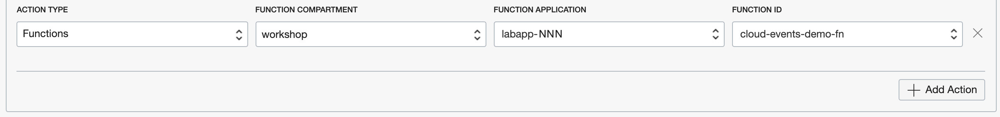

Now that we have set up the rule to trigger your function when your upload an
image to your Object Storage bucket, let's try an end-to-end test.

## End-to-end test

Let's upload an image file to your Object Storage bucket and see your function
triggered automatically by OCI Events service!


Go to your bucket details page in the OCI Object Storage console and upload an
image. Note: If you wish to upload the same image
[sachin-in.jpg](/oci-event-triggers/sachin-in.jpg) again, make sure you delete
the existing image from your bucket and then upload the same image again.


In about 1-2 minutes, check your function logs in PaperTrail! You should see the
following:

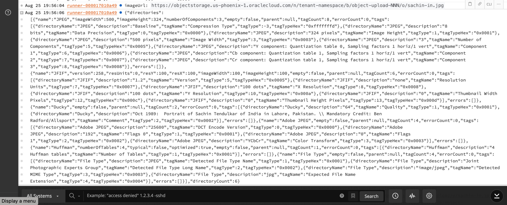


## Wrap Up

Congratulations! In this lab we created a serverless function (to extract image
metadata) that is automatically triggered when an image is uploaded to a given
OCI Object Storage bucket. We learned that cloud event rules can be tied to
various actions within our OCI tenancy such as Object Storage activities and can
automatically trigger serverless Functions, and send Notifications.  

Before you go, don't forget to mark your bucket (object-upload-NNN) as "Private" again!


Click on "Edit Visibility" and select "Private":

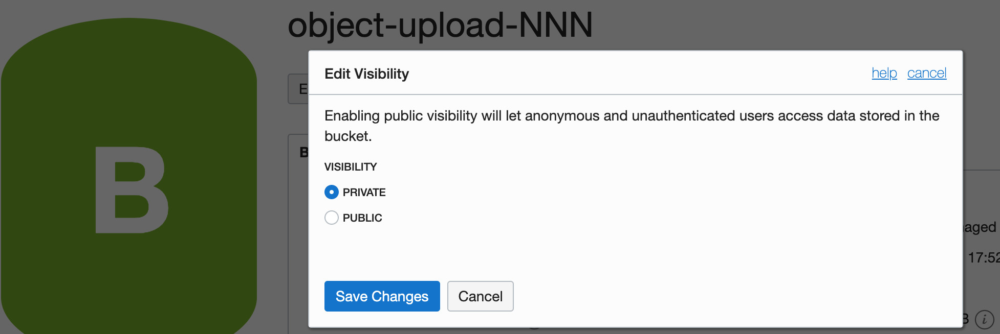


NEXT: [*Functions Clients-OCI SDK*](8-Functions-Clients-SDK.md), UP:
[*Labs*](1-Labs.md), HOME: [*INDEX*](README.md)
